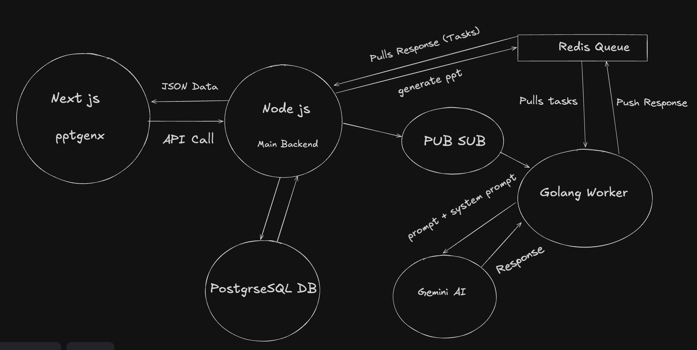

# Encorp AI

Encorp AI is an AI-powered slide generator that takes user input prompts and generates structured presentations using Gemini AI. It supports both PDF and PPT export functionalities.

## Features
- **AI-Powered Slide Generation:** Uses Gemini AI to process prompts and create structured slides.
- **Redis-Based Job Queue:** Ensures efficient task management and processing.
- **Golang Worker Service:** Polls tasks from Redis and interacts with Gemini AI.
- **Node.js Backend:** Handles authentication and API requests.
- **Export Options:** Supports PDF (via jsPDF) and PPT (via pptgenx).

## Architecture



### Workflow
1. **User Input & Authentication**: Users input prompts through the Next.js frontend. Authentication is handled via the Node.js backend with an Auth DB.
2. **Task Queueing**: The `/generate-ppt` route in the backend pushes the prompt to a Redis queue.
3. **Golang Worker Service**: Polls Redis every second to check for pending tasks.
4. **Gemini AI Processing**: Once a task is found, the Golang worker calls the Gemini API, processes the response, and pushes the structured JSON output back to Redis.
5. **Polling Mechanism**: The frontend continuously polls the backend API (every 3 seconds) until the job reaches 100% completion.
6. **Slide Preview**: The JSON response is used to render a preview of the slides.
7. **Export Options**: Users can export slides as:
   - **PDF** (via jsPDF)
   - **PPT** (via pptgenx)

## Future Enhancements
- **S3/Cloudinary Uploads**: Enable users to upload generated PPT files to cloud storage.
- **Image Support in PDFs**: Enhance PDF generation by including images (currently omitted due to high costs of image generation models).

## Tech Stack
- **Frontend**: Next.js (React-based)
- **Backend**: Node.js (Express.js)
- **Queue Management**: Redis
- **Worker Service**: Golang
- **AI Model**: Gemini AI
- **Storage (Upcoming Feature)**: S3/Cloudinary
- **Exports**: jsPDF, pptgenx

## Setup & Installation
1. Clone the repository:
   ```sh
   git clone https://github.com/Rudra-Sankha-Sinhamahapatra/Encorp-AI
   ```
2. Install dependencies:
   ```sh
   cd backend && npm install
   cd frontend && npm install
   ```
3. Start the Redis server.
4. Run the backend:
   ```sh
   cd backend && npm run dev
   ```
5. Run the frontend:
   ```sh
   cd frontend && npm run dev
   ```
6. Start the Golang worker service:
   ```sh
   cd Go-worker && go run main.go
   ```

## Contributing
Feel free to open issues and submit pull requests for new features or improvements!

## License
This project is licensed under the [MIT License](./LICENSE) - see the LICENSE file for details.

Copyright (c) 2025 Rudra Sankha Sinhamahapatra

